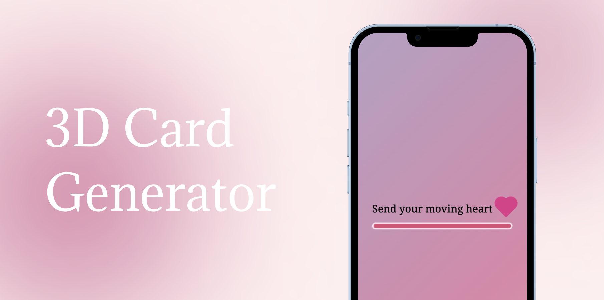

# Send your moving heart 💖



<p align="center">
  " 말만 하는 걸로는 부족하다면,
  <br />
  움직이는 마음을 보내보세요! "
	<br />
  <br />
  https://symh.netlify.app
</p>
<hr/>

<br/>

## 💘 Motivation

<p align="center">
  "움직이는 이모티콘만으로는 부족해! 내 마음을 담은 움직이는 하트를 보낼 수 있다면?!"
</p>


## 📅 Project time

* 2022.06.02 - 현재 

## 🏷️ Features

* 간단한 편지 작성
* 하트 색상 선택
* 보내는 이 이름 기입
* 편지, 하트 색상, 보내는 이를 취합한 3D 카드 생성
* ~~3D 카드 저장~~ [구현 중]

## 📚 Tech stack

* HTML
* CSS
* JavaScript
* React

## ➕ Dependencies

* redux 4.2.0
* @reduxjs/toolkit 1.8.2
* react-router-dom 6.3.0
* @react-three/fiber 8.0.26
* @react-three/drei 9.13.2

## 🎬 Setup

```
npm install
```

## ☑️ Todo

* React Persist 적용: session 활용 유저 데이터 저장
* URL 직접 접근 제한: 카드 생성 순서 보장
* 브라우저 뒤로가기로 이동하는 것 제한: 유저 데이터 유효성에 따른 이동 보장
* 한글 입력 받기: 적용 언어 범위 넓히기

## ✍🏼 Author

* cubodado

## 🪪 License

* MIT License
